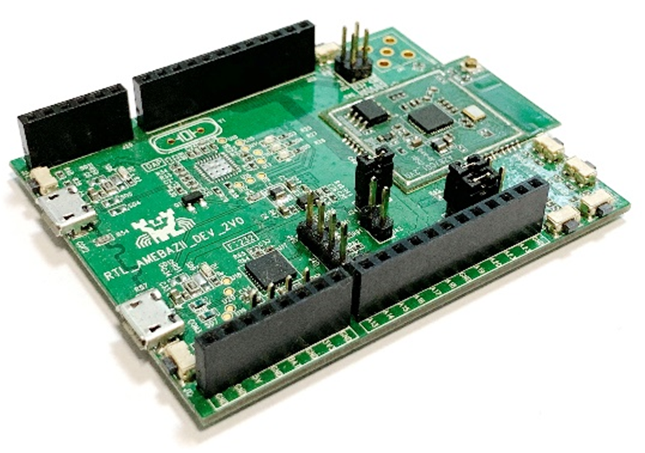
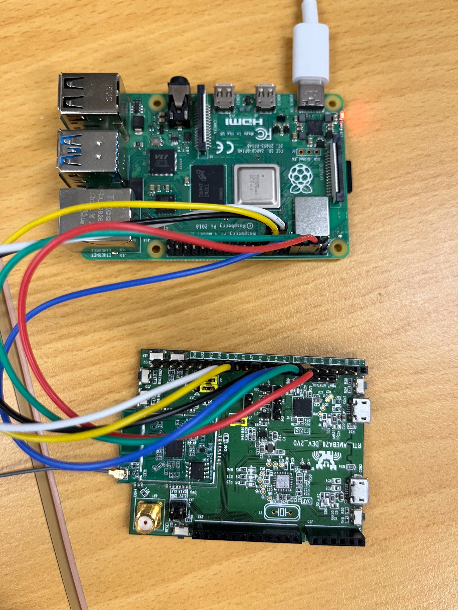
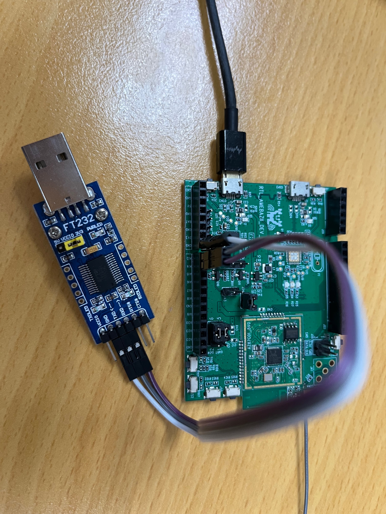
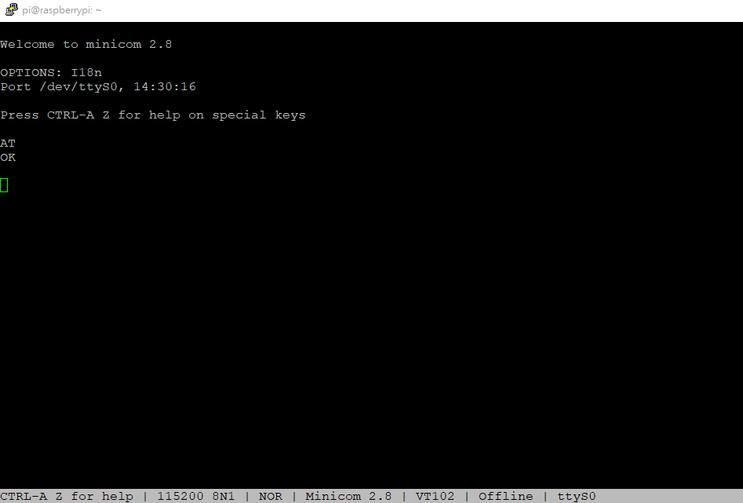
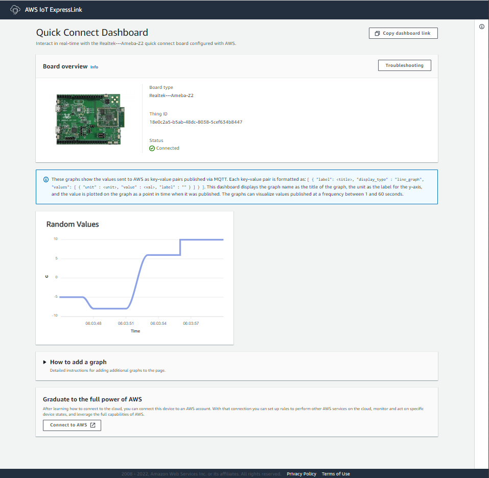
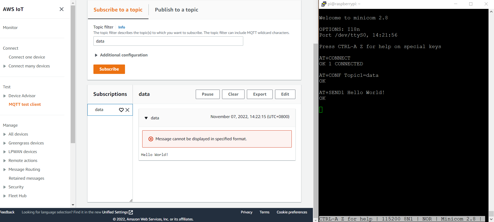
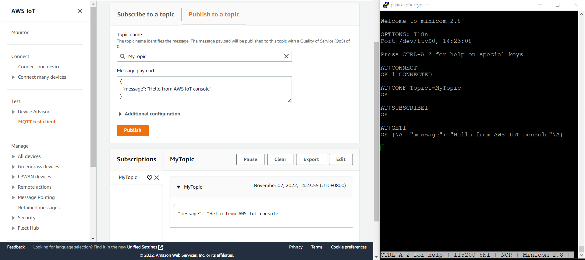

# Getting Started Guide for Realtek's Ameba Z2 AWS IoT ExpressLink Evaluation Kit

## WARNING : 
### Ameba Z2 AWS IoT ExpressLink Evaluation Kit is offers direct access and connections to the AWS Cloud with pre-installed AWS IoT ExpressLink firmware and certificate. 

### !!! Please DO NOT download other firmware or erase flash data. !!!
### !!! Please DO NOT download other firmware or erase flash data. !!!
### !!! Please DO NOT download other firmware or erase flash data. !!!
# Table of Contents

1. [Document Information](#1-document-information)
2. [Overview](#2-overview)
3. [Hardware Description](#3-hardware-description)
4. [Run the Quick Connect demo application](#4-run-the-quick-connect-demo-application)
5. [Setup your AWS account and Permissions for IoT development](#5-setup-your-aws-account-and-permissions-for-iot-development)
6. [Registering ExpressLink to your development account](#6-registering-expresslink-to-your-development-account)
7. [Connecting and Interacting with AWS cloud](#7-connecting-and-interacting-with-aws-cloud)
8. [Perform Firmware Over-The-Air Update for AWS IoT ExpressLink](#8-perform-firmware-over-the-air-update-for-aws-iot-expresslink)
9. [Troubleshooting](#9-troubleshooting)

# 1. Document Information

## 1.1 Revision History (Version, Date, Description of change)

1.0 22-October-2022 Final Draft 

# 2. Overview

AWS IoT ExpressLink is connectivity software that powers a range of hardware modules developed and offered by AWS partners. These modules provide cloud-connectivity and implement AWS-mandated security requirements. Integrating these wireless modules into the hardware design of your device makes it faster and easier to build Internet of Things (IoT) products that connect securely with AWS services.
Realtek's AWS IoT ExpressLink (henceforth referred to as ExpressLink) module is a connectivity module that uses a serial interface (UART) and an abstracted Application Programming Interface (API) to connect any host application processor to AWS IoT Core and its services.
In so doing, the ExpressLink module offloads complex and undifferentiated workloads such as authentication, device management, connectivity, and messaging from the application (host) processor.
More information on AWS IoT ExpressLink can be found [here](https://aws.amazon.com/iot-expresslink/).  
The developer documentation can be found [here](https://docs.aws.amazon.com/iot-expresslink).  
Examples for AWS IoT ExpressLink can be found [here](https://github.com/aws/iot-expresslink).  

>  **NOTE**: Please upgrade your ExpressLink module to the latest available release as shown in [Section 9](#9-upgrading-expresslink-firmware) before proceeding with the Quick Connect demo application from [Section 4](#4-run-the-quick-connect-demo-application), or other examples mentioned in this guide.
>

# 3. Hardware Description

Realtek's Ameba Z2 AWS IoT ExpressLink board (Henceforth referred to as ExpressLink board) has a pin header, so it can be used with a Raspberry Pi or any other host.
It has the following connection pins that need to be made, for full functionality of the board:  

| ExpressLink Pin | Ameba-Z2 EVB GPIO | ITON's module GPIO | 
|-----------------|-------------------|--------------------|
| TX              | PA_14             | PA_14              |
| RX              | PA_13             | PA_13              |
| **EVENT**           | **PA_20**             | **PA_18**              |
| WAKE            | PA_17             | PA_17              |
| RESET           | PA_19             | PA_19              |

**NOTE**: While all the communication between the ExpressLink modules and the AWS cloud is encrypted during transmission (using TLS 1.2 protocol) and at rest, the serial interface (UART) between the host processor and the module is not encrypted.

## 3.1 DataSheet

The Datasheet of Realtek's Ameba Z2 AWS IoT ExpressLink board can be found [here](https://www.amebaiot.com/en/amebaz2/#rtk_amb31).

## 3.2 Standard Kit Contents

- One unit of Realtek's Ameba Z2 AWS IoT ExpressLink.

## 3.3 User Provided items

- Raspberry Pi  
- Any development host

You may also need the following items:  
- MicroUSB cable such as [this](https://www.amazon.com/AmazonBasics-Male-Micro-Cable-Black/dp/B0711PVX6Z/).  
- USB TTL converter such as [this one](https://www.amazon.com/Adapter-Serial-Converter-Development-Projects/dp/B075N82CDL/).
- Female to female jumpers such as [this](https://www.amazon.com/Elegoo-EL-CP-004-Multicolored-Breadboard-arduino/dp/B01EV70C78).

## 3.4 3rd Party purchasable items

[Raspberry Pi purchase link](https://www.raspberrypi.com/products/)  

## 3.5 Additional Hardware References

Refer to the [AmebaZ2 Website](https://www.amebaiot.com/en/amebaz2/#rtk_amb31), for more information on the hardware.

## 3.6 Set up your hardware
To establish a serial connection between your host machine and the Realtek Ameba Z2, you must install the USB to UART Bridge Virtual Communication Port drivers. You can download these drivers from [mbedWinSerial](https://github.com/ambiot/ambz2_sdk/blob/master/tools/serial_to_usb/mbedWinSerial_16466.zip). For more information, see [Realtek Ameba-ZII application note](https://github.com/ambiot/ambz2_aws_iot_expresslink_eval/blob/main/doc/AN0500%20Realtek%20Ameba-ZII%20application%20note.en.pdf).

## 3.6.1 With Raspberry Pi

1. To connect the ExpressLink board to the Raspberry Pi, you need to connect the TX, RX, EVENT, WAKE and RESET male pins of the J13 connector on the ExpressLink board to the following GPIO pins of the Raspberry Pi (using female-to-female jumpers):

| ExpressLink Pin | Raspberry Pi GPIO |
|-----------------|-------------------|
| RESET           | GPIO 4            |
| WAKE            | GPIO 27           |
| EVENT           | GPIO 22           |
| RX              | GPIO 15           |
| TX              | GPIO 14           |
| IOREF           | 3V3 Power         |
| GND             | GND               |

2. You can now access ExpressLink on your Raspberry Pi, by using a desktop terminal application of your choice and using /dev/ttyS0 with the settings as shown in the table in Section 3.7

## 3.6.2 With any development host
The ExpressLink board can be used with any development host, over a USB serial interface (using a USB-to-TTL converter) and using the simple AT commands for controlling ExpressLink.

| ExpressLink Pin | USB-to-TTL converter |
|-----------------|----------------------|
| RX              | RX                   |
| TX              | TX                   |
| GND             | GND                  |

Please note that, in this case, additional functionality like WAKE and EVENT cannot be utilised, but this can serve as a simple way for a quick evaluation and understanding behaviour of commands.

## 3.7 Set up host machine

To establish a serial connection between your host machine and ExpressLink, open a desktop terminal application for your host machine (e.g., TeraTerm for Windows, MiniCom for Mac) and select the port corresponding to the evaluation kit. Configure the desktop terminal application as follows:  

| Config Option | Value     |
| ------------- | --------- |
| Baudrate      | 115200    |
| Bits          | 8         |
| Parity        | None      |
| Stopbit       | 1         |
| Flow control  | None      |
| Local Echo    | Yes       |

For a quick check, in the terminal window type: **AT** followed by **return**. If you receive the answer **OK** , Congratulations! You have successfully connected the evaluation kit to your host machine.

# 4. Run the Quick Connect demo application
The Quick Connect demo application allows you to establish a connection with AWS IoT, all in the space of a few minutes; no dependencies to install, no source code to download and build, and no AWS account required. 

> **Note:** This demo is designed for ExpressLink boards running ExpressLink firmware v1.X.X and up.

To run the demo, follow the below steps:

1.	If you opened a terminal application in the previous step, be sure to disconnect that application from the serial port. 
2.	Download the Quick Connect executable:  
A.	[Download for Mac](https://quickconnectexpresslinkutility.s3.us-west-2.amazonaws.com/QuickConnect_v1.9_macos.x64.tar.gz)  
B.	[Download for Windows](https://quickconnectexpresslinkutility.s3.us-west-2.amazonaws.com/QuickConnect_v1.9_windows.x64.zip)  
C.	[Download for Linux](https://quickconnectexpresslinkutility.s3.us-west-2.amazonaws.com/QuickConnect_v1.9_linux.x64.tar.gz)  
3.	Unzip the package. You will see a config.txt file. Open this and enter the serial port corresponding to the evaluation kit (for example, `COM5`, `/dev/ttyS0`, and so on) in the serial port field.  
4.	Enter your Wi-Fi credentials in the SSID and Passphrase fields.  
5.	Run the "Start_Quick_Connect" executable.  

The demo will connect to AWS IoT and give you a URL that you can use to visualize data flowing from the device to the cloud using **AT+SEND** commands. The demo will run for up to two minutes, and afterwards, you will be able to type **AT+SEND** commands yourself and see the data coming in on the visualizer. 

The following sections will guide you through next steps where you will set up your AWS account and interact with the modules to send and receive data directly with your AWS account.

# 5. Setup your AWS account and Permissions for IoT development

Refer to the online AWS documentation at [Set up your AWS Account](https://docs.aws.amazon.com/iot/latest/developerguide/setting-up.html). Follow the steps outlined in the sections below to create your account and a user and get started:

- [Sign up for an AWS account](https://docs.aws.amazon.com/iot/latest/developerguide/setting-up.html#aws-registration)
- [Create a user and grant permissions](https://docs.aws.amazon.com/iot/latest/developerguide/setting-up.html#create-iam-user)
- [Open the AWS IoT console](https://docs.aws.amazon.com/iot/latest/developerguide/setting-up.html#iot-console-signin)

Pay special attention to the Notes.

# 6. Registering ExpressLink to your development account

To create an IoT _Thing_ and add it to your account we will need to retrieve the AWS IoT ExpressLink module Thing Name and its corresponding certificate. Follow the below steps:

1. Open the [AWS IoT Console](http://console.aws.amazon.com/iot). Select **Manage** then select **Things**. Choose **Create things** , select **Create single thing** , click **Next**.
2. In the terminal application type the command: **AT+CONF? ThingName**
3. Copy the returned string (a sequence of alphanumeric characters) from terminal. On the **Specify thing properties** page, paste the copied string from terminal into the **Thing name** under **Thing properties** on the console. Leave other fields as default, then click **Next**
4. In the terminal application type the command: **AT+CONF? Certificate pem**
5. Copy the returned string (a longer sequence of alphanumeric symbols), save into a text file on your host machine as "ThingName.cert.pem".
6. On the **Configure device certificate page** , select **Use my certificate** , choose **CA is not registered with AWS IoT.**
7. Under **Certificate** , select **Choose file**. Double click on "ThingName.cert.pem" file in step 5.
8. Under **Certificate Status** , select **Active**
9. Click **Next** to **Attach policies to certificate**.
10. Under **Secure** , select **Policies.**
11. Click **Create** to **Create a policy**. Put policy name (e.g. IoTDevPolicy) and click **Advanced mode**.
12. Copy the below section into the console.

`
{ "Version": "2012-10-17", "Statement": [{ "Effect": "Allow", "Action": "*", "Resource": "*" }] }
`

NOTE – The examples in this document are intended only for dev environments. All devices in your fleet must have credentials with privileges that authorize only intended actions on specific resources. The specific permission policies can vary for your use case. Identify the permission policies that best meet your business and security requirements. For more information, refer to [Example policies](https://docs.aws.amazon.com/iot/latest/developerguide/example-iot-policies.html) and [Security Best practices](https://docs.aws.amazon.com/iot/latest/developerguide/security-best-practices.html).

Click **Save** to complete the Thing creation.

13. In the AWS IoT Console, choose **Settings** , copy your account _Endpoint_ string under _Device data endpoint._
14. In the desktop terminal application type the command: **AT+CONF Endpoint=<_your-endpoint-string-here_>**

## 6.1 Set up for Wi-Fi

AWS IoT ExpressLink modules that support Wi-Fi connectivity require access to a local Wi-Fi router in order to connect to the internet. You can enter the required security credentials with the following two additional steps:

1. In the desktop terminal application type the command: **AT+CONF SSID=<_your-router-ssid_>**
2. In the desktop terminal application type the command: **AT+CONF Passphrase=<_your-router-passphrase_>**

**Note** : Your local router's SSID and passphrase are stored securely inside the ExpressLink module. While the SSID can be retrieved later (i.e., for debugging purposes) any attempt to retrieve the Passphrase will return an error.

## 6.2 Completion

Congratulations! You have completed the registration of the evaluation kit as a Thing in your IoT account. You will not need to repeat these steps the next time you connect, as the AWS IoT ExpressLink module will remember its configuration and will be ready to connect to your AWS account automatically.

# 7. Connecting and Interacting with AWS cloud

We will use the MQTT client in the AWS IoT console to help us monitor the communication between your evaluation kit and the AWS Cloud.

1. Navigate to the AWS IoT console ([https://console.aws.amazon.com/iot/](https://console.aws.amazon.com/iot/)).
2. To open the MQTT client, in the navigation pane, choose **Test** and then **MQTT Test Client.**
3. In _Subscribe to a topic_, enter #, and then click **Subscribe**.

## 7.1 Connecting

Establish a secure connection by entering the command: **AT+CONNECT**

After a short time, you will receive the message **OK 1 CONNECTED**

Congratulations! You have successfully connected to your AWS cloud account.

## 7.2 Sending data to the AWS cloud

To send “Hello World!” message, first enter the command **AT+CONF Topic1=data**

You will receive the response from the module: **OK**

Next, enter the command: **AT+SEND1 Hello World!**

After a short time, you will receive the message **OK**

You should see the "Hello World!" message appear on the AWS IoT MQTT Test client under the topic "data".

## 7.3 Receiving data and commands from the cloud

To receive messages, first enter the command: **AT+CONF Topic1=MyTopic**

You will receive the response from the module: **OK**

Next, enter the command: **AT+SUBSCRIBE1**

From the AWS IoT console, MQTT client, select **Publish to a topic** , type **MyTopic** in **Topic name** field, keep **"Hello from the AWS IoT console"** message then click "Publish".

On your terminal, enter the command: **AT+GET1**

You will receive the message **OK Hello from the AWS IoT console**

# 8. Perform Firmware Over-The-Air Update for AWS IoT ExpressLink

## 8.1 Prerequisites

You should have received a firmware image signed by the manufacturer of the ExpressLink module. Along with the firmware image, you should receive additional signing metadata such as:
1. Signature hashing algorithm used (Example: SHA-256)
2. Signature encryption algorithm used (Example: ECDSA)
3. Actual signature encoded using the base64 encoding format.
4. The path name (a string) which identifies the location where the certificate is provisioned in the ExpressLink (optional)
5. Create an OTA Update role in your account using the steps outlined [here](https://docs.aws.amazon.com/freertos/latest/userguide/create-service-role.html).

## 8.2 Creating a Firmware Update job in AWS IoT

1. Open [AWS IoT Console](http://console.aws.amazon.com/iot). Select **Manage** then select **Jobs**. Choose **Create job** , select **Create FreeRTOS OTA Update Job** , click **Next**.
2. Provide a job name which is unique within your AWS account. Provide an optional description. Click **Next**.
3. From **Devices to update** dropdown choose the thing name with which the ExpressLink is registered with the account. Select **MQTT** as the protocol to transfer, and unselect **HTTP** if selected.
4. Choose **Use my custom signed file** which will display a form to be filled. Use the details from the prerequisites to fill the form.
5. In the **signature** field provide the base64 encoded signature for the image. From the **Original hashing algorithm** drop down, select the hashing algorithm provided by the manufacturer. From the **Original encryption algorithm** drop down, select the encryption algorithm provided by the manufacturer. For **Path name of code signing certificate on device**, fill the box with path name if any provided by the manufacturer. If path name is not provided then you can just enter **NA**.
6. Select **Upload a new file** , click on **Choose file** and upload the firmware binary. Choose the S3 bucket in your account that you had created in the prerequisite steps, by selecting **Browse S3** option.
7. Under **Path Name of file on device** you can enter **NA**.
8. Under **File type** drop down set value to `101` to signify it's an ExpressLink firmware update as opposed to a host firmware update.
9. Choose the OTA update role created above from **role** dropdown under **IAM role** section. Click **Next**.
10. Click **Create Job**. On successful creation it should list the job name and state as "in progress".

## 8.3 Monitoring and Applying new firmware update for ExpressLink

You need to add the signature obtained previously, to the ExpressLink board so that the firmware can be verified.  
Start by giving the command:  
**AT+CONF OTACertificate=PEM**  
The module will respond with "OK" and go into "Certificate writing" mode.  
You can then paste the contents of the ecdsasigner.crt file in your terminal.  

1. ExpressLink module polls for firmware update jobs, receives and validates a job, and enters a state waiting for update to be accepted.
2. Host application receives an OTA event indicating a new firmware image is available for ExpressLink. Host application can query the state of the job using the command **AT+OTA?**. You should see the module response **OK 1 version** to inform a module OTA firmware update was proposed.
3. Host application can accept a new firmware update by issuing command **AT+OTA ACCEPT**.
4. ExpressLink should now start downloading the firmware update from cloud. Host can monitor the state of the job using **AT+OTA?**
5. On download completion and successful image signature validation, host receives an event to apply the new image.
6. Host application can apply the new image by issuing the command **AT+OTA APPLY**
7. ExpressLink now reboots and boots up with the new image. Host receives a **STARTUP** event indicating the new image is booted. To see the event, issuing **AT+EVENT?**. (Notes: the event queue is shown in FIFO order, you may have to issue **AT+EVENT?** command multiple times, depending on how many events are previously on the queue).
8. Host application can connect back to the AWS IoT by issuing **AT+CONNECT**
9. ExpressLink should now connect to AWS IoT, complete the self-test and mark the image as valid preventing any further rollback to old image.
10. Going back to the AWS IoT console, job status should be marked as completed and succeeded.

**Note**: You need to run **AT+CONNECT** after the OTA update has been applied in order to complete the OTA. Failure to do so during the first bootup of the new firmware, will result in a rollback to the previous firmware.

# 9. Troubleshooting

1. If you are not able to establish connection over the UART using microUSB port on the ExpressLink board in step 6, you will need to download the drivers for it and check the additional information for your operating system in the [application note](https://www.amebaiot.com/en/ameba-sdk-summary).

2. For Realtek-Ameba-z2 usage issues, please refer [AMEBA IoT forum](https://forum.amebaiot.com/) to create your issue.

3. For common AT command issues, please refer to [AWS IoT ExpressLink FAQ](https://aws.amazon.com/iot-expresslink/faqs/?nc1=h_ls) page.
